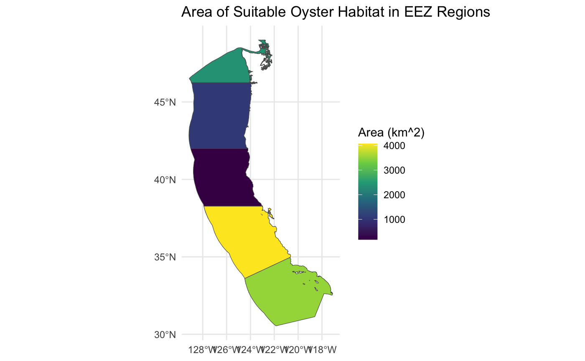
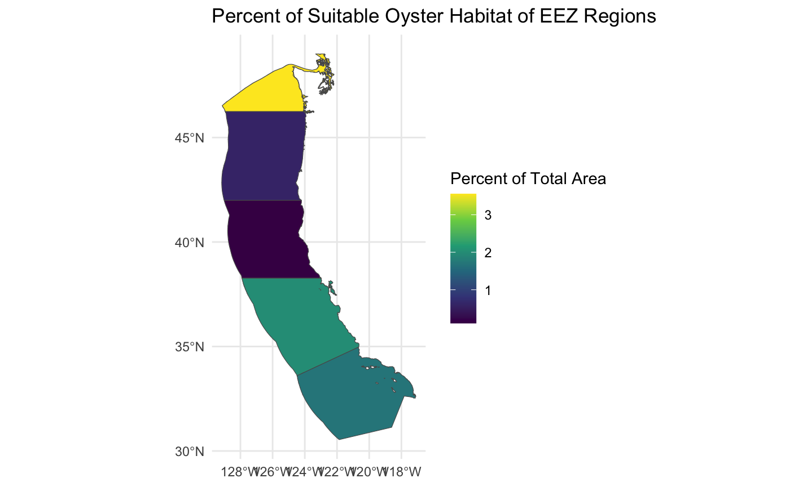

```{r setup, include=FALSE}
knitr::opts_chunk$set(echo = TRUE)
```

# Geospatial Analysis of Suitable Oyster Habitat within US West Coast EEZ Regions

Author: Fletcher McConnell

Github Repository: <https://github.com/fletcher-m/oyster-habitat>

## About

This R Markdown document contains code and outputs that analyse suitable habitats for Oysters to live in and compares these ranges with potential areas within EEZ regions on the US west coast.

## Highlights

-   Data wrangling and exploration with `tidyverse`

-   Geospatial data wrangling with `sf` and `terra`

-   Map making with `GGPlot`

-   Creating and customizing spatial plot

## About the Data

There are 3 main datasets that I worked with for this project. They are as follows:

Sea Surface Temperature Data:

-   I used data from the average annual sea surface temperature from the years 2008 to 2012. These came in the form of 5 different ".tif" files (one per year) that I joined into one stack. The data can be accessed here: [NOAA's 5km Daily Global Satellite Sea Surface Temperature Anomaly v3.1] <https://coralreefwatch.noaa.gov/product/5km/index_5km_ssta.php>

Bathymetry Data:

-   I used the General Bathymetry Chart of the Oceans (GEBCO) for the depth data. This data can be accessed here: [General Bathymetric Chart of the Oceans (GEBCO)] <https://www.gebco.net/data_and_products/gridded_bathymetry_data/#area>

Exclusive Economic Zone (EEZ) Data:

-   This data specifies maritime boundaries for the EEZ zones off of the west coast of the US. This data can be accessed here: [Marineregions.org] <https://www.marineregions.org/eez.php>

## Final Output



## 

## Load Packages

```{r, results='hide'}
# load packages
library(sf)
library(terra)
library(here)
library(dplyr)
library(tmap)
library(tidyverse)
library(stringr)
library(ggplot2)
library(raster)
```

## Load Data and Set Same CRS

```{r}
# read in shape file 
wc_eez <- st_read("data/wc_regions_clean.shp")

# read in SST rasters
sst_2008 <- rast("/Users/fletchermcconnell/Documents/EDS 223/eds223-hw4/data/average_annual_sst_2008.tif")
sst_2009 <- rast("/Users/fletchermcconnell/Documents/EDS 223/eds223-hw4/data/average_annual_sst_2009.tif")
sst_2010 <- rast("/Users/fletchermcconnell/Documents/EDS 223/eds223-hw4/data/average_annual_sst_2010.tif")
sst_2011 <- rast("/Users/fletchermcconnell/Documents/EDS 223/eds223-hw4/data/average_annual_sst_2011.tif")
sst_2012 <- rast("/Users/fletchermcconnell/Documents/EDS 223/eds223-hw4/data/average_annual_sst_2012.tif")

# combine rasters into a raster stack
all_sst <- c(sst_2008, sst_2009, sst_2010, sst_2011, sst_2012)

# read in bathymetry raster
depth <- rast("/Users/fletchermcconnell/Documents/EDS 223/eds223-hw4/data/depth.tif")

# reproject to same crs
all_sst <- project(all_sst, crs(depth))
```

## Process Data

```{r}
# find mean SST
all_sst_mean <- mean(all_sst)

# convert SST data to Celsius
all_sst_mean <- all_sst_mean - 273.15

# crop depth to match SST raster
depth <- crop(depth, all_sst_mean)

# resample depth data to match SST resolution
depth <- resample(x = depth, y =  all_sst_mean, method = "near")

# check that that depth and SST match in resolution, extent and crs (by stacking them)
depth_sst <- c(depth, all_sst_mean)
```

## Find Suitable Oyster Habitat Locations

```{r}
# set range for habitable oyster depth
depth_matrix <- matrix(c(-70, 0, 1,
                    -Inf, -70, NA, 0, Inf, NA),
                    byrow = TRUE, ncol = 3)

depth_sst <- classify(depth, depth_matrix)

# set habitable range for oyster temperature
temp_matrix <- matrix(c(11, 30, 1,
                        -Inf, 11, NA, 30, Inf, NA),
                      byrow = TRUE, ncol = 3)

temp_sst <- classify(all_sst_mean, temp_matrix)

ocean <- stack(x = c(depth_sst, temp_sst))

# find habitat that satisfies both temp range and depth range
function_1 <- function(x, y){
  ifelse(x ==1 & y == 1, 1, NA)
}
suitable_habitat <- lapp(rast(ocean), fun = function_1)
plot(suitable_habitat)
```

## Determine Suitable Locations Within EEZ's

```{r}
# convert eez data into raster format
wc_eez_raster <- rasterize(wc_eez, depth, field = "rgn")

# find area of suitable habitat within each eez
area <- expanse(suitable_habitat, unit = "km", zones = wc_eez_raster)

# join calculate percent of suitable habitat and join back with eez data
total_suitable_area <- merge(wc_eez, area,
      by.x = "rgn",
      by.y = "zone",
      all.x = TRUE) |> 
  mutate(p_area = (area/area_km2) * 100)

total_suitable_area
```

## Visualize Results

### Total Suitable Area Within EEZ's

```{r}
# plot eez regions by total suitable area
ggplot(total_suitable_area) +
  geom_sf(aes(fill = area)) +
  scale_fill_viridis_c() +
  labs(title = "Area of Suitable Oyster Habitat in EEZ Regions", fill = "Area (km^2)") +
  theme_minimal()
```

### Percent Suitable Area Within EEZ's

```{r}
# plot eez regions by percent of total area that is suitable
ggplot(total_suitable_area) +
  geom_sf(aes(fill = p_area)) +
  scale_fill_viridis_c() + 
  labs(title = "Percent of Suitable Oyster Habitat of EEZ Regions", fill = "Percent of Total Area") +
  theme_minimal()
```

# Generalize Workflow

## Create a Function to Accept Other Species' Ranges

```{r}
species_range_function <- function(species, min_depth, max_depth, min_temp, max_temp) {
  
  depth_input <- matrix(c(max_depth, min_depth, 1,
                    -Inf, max_depth, NA, min_depth, Inf, NA),
                    byrow = TRUE, ncol = 3)
  
  depth_classify <- classify(depth, depth_input)
  
  temp_input <- matrix(c(min_temp, max_temp, 1,
                        -Inf, min_temp, NA, max_temp, Inf, NA),
                      byrow = TRUE, ncol = 3)
  
  temp_classify <- classify(all_sst_mean, temp_input)
  
  stack <- stack(x = c(depth_classify, temp_classify))
  
  ocean_function <- function(x, y){
  ifelse(x ==1 & y == 1, 1, NA)
}
  oyster_habitat <- lapp(rast(stack), fun = ocean_function)
  
  eez_raster <- rasterize(wc_eez, depth, field = "rgn") # not sure about this one
  
  oyster_area <- expanse(oyster_habitat, unit = "km", zones = eez_raster)
  
  joined_data <- merge(wc_eez, oyster_area,
      by.x = "rgn",
      by.y = "zone",
      all.x = TRUE) |> 
  mutate(p_area = (area/area_km2) * 100)
  
  fish_area_plot <- ggplot(joined_data) +
    geom_sf(aes(fill = area)) +
    scale_fill_viridis_c() + 
    labs(title = "Area of Suitable", species, "Habitat in EEZ Regions", fill = "Area (km^2)")
  
  print(fish_area_plot)
  
  fish_percent_plot <- ggplot(joined_data) +
    geom_sf(aes(fill = p_area)) +
    scale_fill_viridis_c() + 
    labs(title = "Percent of Suitable", species, "Habitat of EEZ Regions", fill = "Percent of Total Area")
  
  print(fish_percent_plot)
  
}
```

## Use function for Skipjack Tuna Temperature and Depth Ranges

```{r}
species_range_function("Skipjack Tuna", 0, -260, 10, 21)
```
